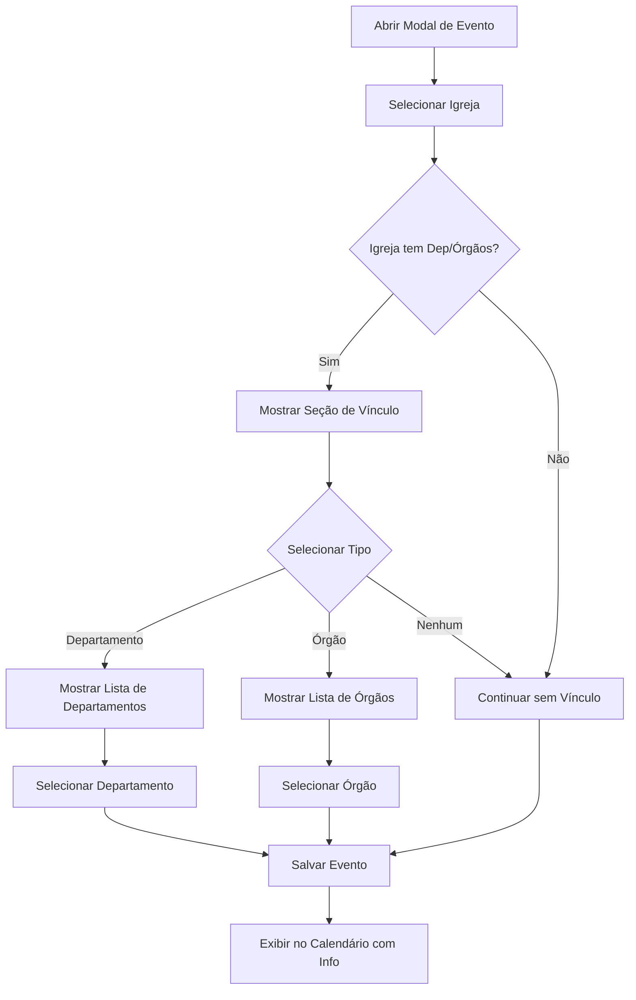

# 📅 Vinculação de Eventos com Departamentos e Órgãos

## 📋 Resumo das Alterações

Este documento descreve as melhorias implementadas no sistema de eventos, permitindo vincular eventos a departamentos ou órgãos da igreja.

---

## ✨ Nova Funcionalidade

### **Vinculação Opcional de Eventos**

Ao criar ou editar um evento, agora é possível vincular o evento a:
- **Departamento** (ex: DEJEADALPE, EBD, UMADALPE, etc.)
- **Órgão** (ex: Banda, Coral, etc.)

**Regras:**
- ✅ A vinculação é **opcional** (não obrigatória)
- ✅ Só pode escolher **UM** dos dois (departamento OU órgão)
- ✅ A seleção aparece **após escolher a igreja**
- ✅ Só aparecem departamentos e órgãos da igreja selecionada

---

## 🎯 Como Utilizar

### **1. Criar Evento com Vínculo**

1. Clique em **"Novo Evento"** no calendário
2. Preencha os campos obrigatórios:
   - Título
   - Data/Hora de Início
   - Data/Hora de Fim
   - Selecione a **Igreja**
3. Após selecionar a igreja, aparecerá uma seção **"Vincular a (Opcional)"**
4. Escolha o tipo de vínculo:
   - **Nenhum** (padrão)
   - **Departamento**
   - **Órgão**
5. Se escolher **Departamento**, selecione um departamento da lista
6. Se escolher **Órgão**, selecione um órgão da lista
7. Clique em **"Salvar"**

### **2. Visualizar Evento com Vínculo**

Os eventos vinculados aparecem no calendário com informação adicional:

**No Card do Evento:**
- 📋 **Ícone de departamento** + nome (se vinculado a departamento)
- 🎵 **Ícone de órgão** + nome (se vinculado a órgão)

**No Tooltip (ao passar o mouse):**
- Exibe "📋 Departamento: [Nome]" ou
- Exibe "🎵 Órgão: [Nome]"

**Na Lista de Eventos do Dia:**
- Mostra o nome do departamento/órgão após o título do evento

---

## 🔧 Alterações Técnicas

### **1. Backend (Server)**

#### **Arquivo: `shared/api.ts`**
Atualizadas interfaces `Evento` e `CriarEventoDTO`:
```typescript
export interface Evento {
  // ... campos existentes
  departamentoId?: string | null;
  orgaoId?: string | null;
}

export interface CriarEventoDTO {
  // ... campos existentes
  departamentoId?: string | null;
  orgaoId?: string | null;
}
```

#### **Arquivo: `server/routes/eventos.ts`**
Atualizada criação de eventos para salvar vínculos:
```typescript
const novo: Evento = {
  // ... campos existentes
  departamentoId: dados.departamentoId ?? null,
  orgaoId: dados.orgaoId ?? null,
};
```

### **2. Frontend (Client)**

#### **Arquivo: `client/components/agenda/EventoModal.tsx`**

**Novos Estados:**
```typescript
const [tipoVinculo, setTipoVinculo] = useState<"" | "departamento" | "orgao">("");
const [departamentoId, setDepartamentoId] = useState<string>("");
const [orgaoId, setOrgaoId] = useState<string>("");
```

**Lógica de Seleção:**
- Ao selecionar igreja, limpa vínculos anteriores
- Ao escolher tipo de vínculo, limpa o outro tipo
- Ao salvar, envia apenas o ID do tipo selecionado

**Nova Seção no Formulário:**
```tsx
{/* Vinculação com Departamento ou Órgão */}
{igrejaSelecionada && (igrejaSelecionada.departamentos?.length || igrejaSelecionada.orgaos?.length) ? (
  <div className="border border-border rounded-lg p-3 space-y-3 bg-muted/30">
    <label className="block text-sm font-medium">Vincular a (Opcional)</label>
    {/* Seletor de tipo e lista correspondente */}
  </div>
) : null}
```

#### **Arquivo: `client/components/agenda/CalendarioPrincipal.tsx`**

**Exibição no Card do Evento:**
```tsx
// Buscar departamento ou órgão vinculado
const departamento = ev.departamentoId && igreja?.departamentos?.find(d => d.id === ev.departamentoId);
const orgao = ev.orgaoId && igreja?.orgaos?.find(o => o.id === ev.orgaoId);

// Exibir no card
{(departamento || orgao) && (
  <div className="opacity-75 text-[10px] truncate">
    {departamento ? `📋 ${departamento.nome}` : `🎵 ${orgao!.nome}`}
  </div>
)}
```

**Exibição no Tooltip:**
```tsx
{departamento && <div className="text-xs">📋 Departamento: {departamento.nome}</div>}
{orgao && <div className="text-xs">🎵 Órgão: {orgao.nome}</div>}
```

---

## 📊 Exemplos de Uso

### **Exemplo 1: Evento de Departamento**
```
Título: Reunião de Líderes
Igreja: Igreja Central
Tipo: Departamento
Departamento: DEJEADALPE
```
**Resultado:** Evento aparece com ícone 📋 e texto "DEJEADALPE"

### **Exemplo 2: Evento de Órgão**
```
Título: Ensaio Banda
Igreja: Igreja Central
Tipo: Órgão
Órgão: Banda
```
**Resultado:** Evento aparece com ícone 🎵 e texto "Banda"

### **Exemplo 3: Evento sem Vínculo**
```
Título: Culto de Domingo
Igreja: Igreja Central
Tipo: Nenhum
```
**Resultado:** Evento aparece normalmente, sem informação adicional

---

## 🎨 Interface do Usuário

### **Seção de Vinculação no Modal de Evento**

```
┌─────────────────────────────────────────┐
│ Vincular a (Opcional)                   │
│                                         │
│ ┌─────────────┐  ┌──────────────────┐  │
│ │ Tipo        │  │ Departamento     │  │
│ │ [Departa▼]  │  │ [DEJEADALPE   ▼] │  │
│ └─────────────┘  └──────────────────┘  │
└─────────────────────────────────────────┘
```

### **Visualização no Calendário**

```
┌────────────────────────┐
│ 🟢 Reunião de Líderes │
│    09:00-11:00         │
│    📋 DEJEADALPE       │
└────────────────────────┘
```

---

## ✅ Validações Implementadas

- ✅ Não permite selecionar departamento E órgão ao mesmo tempo
- ✅ Ao mudar de igreja, limpa seleções anteriores
- ✅ Ao mudar tipo de vínculo, limpa o ID do outro tipo
- ✅ Campos opcionais (pode criar evento sem vínculo)
- ✅ Só exibe seção de vínculo se a igreja tiver departamentos ou órgãos

---

## 🔄 Fluxo Completo



---

## 🚀 Melhorias Futuras Sugeridas

- [ ] Filtrar eventos por departamento ou órgão
- [ ] Relatórios de eventos por departamento/órgão
- [ ] Estatísticas de uso de departamentos/órgãos
- [ ] Notificações para membros do departamento/órgão
- [ ] Agendamento recorrente para departamentos/órgãos

---

## 📝 Notas Importantes

1. **Compatibilidade:** Eventos criados antes desta atualização continuam funcionando normalmente (sem vínculo)
2. **Migração:** Não é necessária migração de dados
3. **Performance:** A busca de departamentos/órgãos é feita em memória (rápida)
4. **UX:** A interface só aparece quando relevante (igreja com dep/órgãos)

---

**Última atualização:** 13 de outubro de 2025  
**Versão:** 2.0
